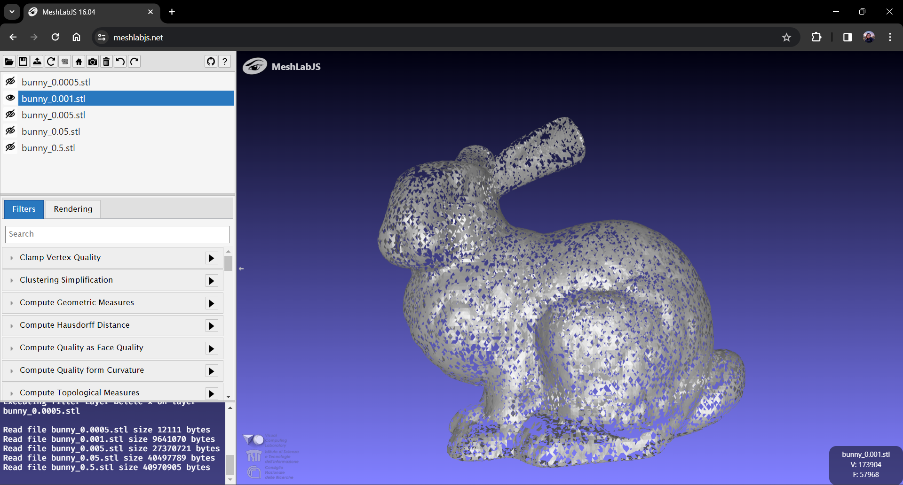

# Report - IMA208 - TP7

**Authors: William Liaw; Anastasiia Karpova**

We tried out different thresholds (alpha) for the maximum radius of the circumscribing circle for the Delaunay algorithm. According to our results, shown bellow, we found the best alpha to be 0.005. It is noteworthy that we had to iteratively check which value of alpha was best. Another point to take into consideration is different regions of the final mesh may have different optimal values of alpha. Both of this issues could be solved with an adaptive threshold estimation of alpha.

- 0.0005
  
- 0.001
  
- 0.005
  
- 0.05
  
- 0.5
  
